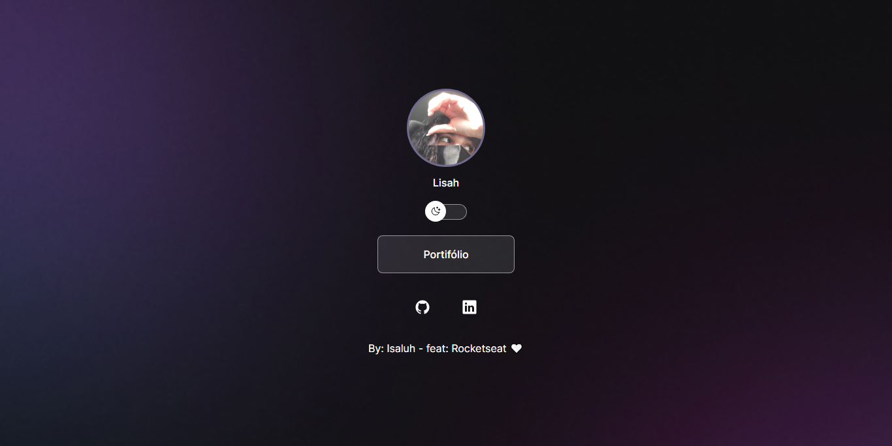

<h1 align="center"> Links </h1>

Links de perfil com dark e light mode  

  <a href="#-tecnologias">Tecnologias</a>&nbsp;&nbsp;&nbsp;|&nbsp;&nbsp;&nbsp;
  <a href="#-projeto">Projeto</a>&nbsp;&nbsp;&nbsp;|&nbsp;&nbsp;&nbsp;
  <a href="#-layout">Layout</a>

 

  

## 🎓 Tecnologias

Esse projeto foi desenvolvido com as seguintes tecnologias:

- HTML e CSS
- JavaScript
- Git e Github
- Figma

## 📔 Projeto

O projeto é para aqueles que querem divulgar suas redes e/ou trabalhos por links vinculados a uma página.

- [Visite o projeto online](https://isaluh.github.io/links)

## 🏯 Layout

Visualise o layout do projeto através [desse link](https://www.figma.com/file/jqge1DvvFjSM7adC3TBmwO/DevLinks-%E2%80%A2-Projeto-Discover-(Community)?type=design&node-id=10-620&mode=design&t=vJYxPzkEWylBbW5T-0). É necessário ter conta no [Figma](https://figma.com) para acessá-lo.

---

<h4 align="center">By: Isaluh - feat: Rocketseat 🤍</h4>